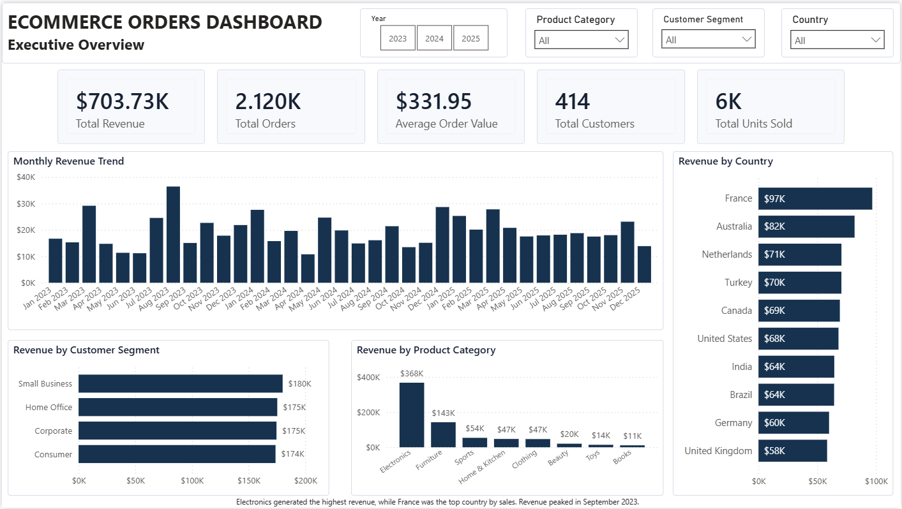
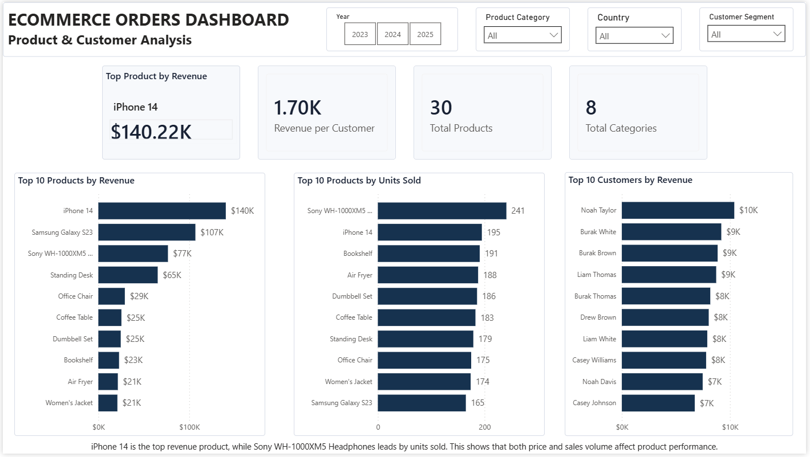
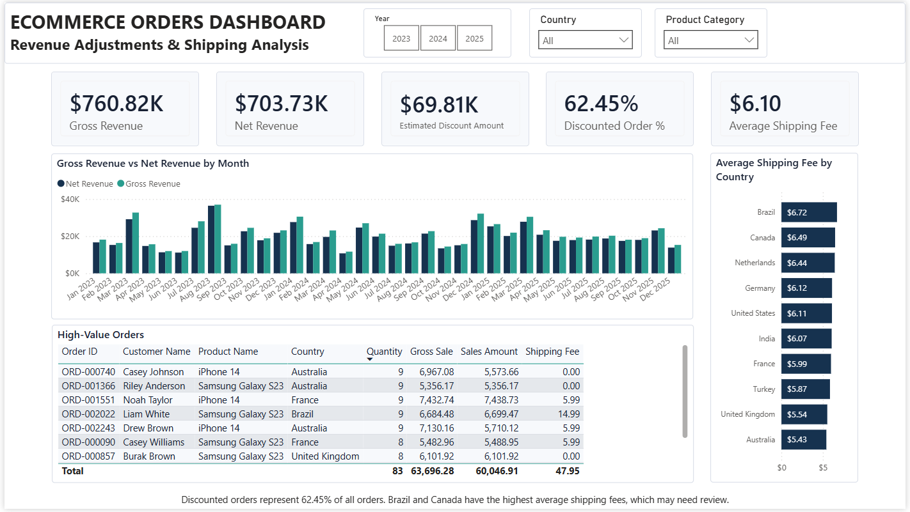

# Ecommerce Orders Data Cleaning and EDA Using PostgreSQL

## Project Overview

This portfolio project uses a deliberately messy ecommerce orders dataset to practice data cleaning and exploratory data analysis with PostgreSQL.

The dataset is synthetic and was created with the help of ChatGPT for learning and portfolio purposes. It does not contain real customer, company, or transaction data.

The completed project includes:

- SQL data cleaning
- SQL exploratory data analysis
- Dataset quality notes
- Completed Power BI dashboard file
- Dashboard screenshots and optional PDF export
- DAX measures for dashboard KPIs
- Clean dataset export

The Power BI dashboard was created in Power BI Desktop and exported for GitHub review.

## Business Goal

The goal of this project is to turn messy ecommerce order data into a clean dataset that can be used to answer business questions about sales performance, customers, products, countries, discounts, shipping, and monthly trends.

## Dataset Note

This project uses a synthetic ecommerce orders dataset created with the help of ChatGPT. The focus of the project is the analyst workflow: cleaning messy data, writing SQL analysis queries, building dashboard KPIs, and communicating business insights.

## Tools Used

- PostgreSQL
- pgAdmin 4
- CSV dataset
- Power BI Desktop

## Current Project Files

| File | Description |
|---|---|
| `ecommerce_portfolio_dirty_dataset.csv` | Raw dirty ecommerce orders dataset with 2,361 rows and 12 columns |
| `01_database_setup_import.sql` | Creates the PostgreSQL schema, creates the raw table, and gives import instructions |
| `02_data_cleaning.sql` | Cleans the raw ecommerce data and creates the final `ecommerce_clean` table |
| `03_eda_analysis.sql` | Performs exploratory data analysis on the cleaned ecommerce data |
| `04_export_clean_dataset.sql` | Provides instructions and SQL for exporting the cleaned dataset to CSV |
| `dataset_quality_notes.txt` | Notes about known dirty data issues in the raw dataset |
| `ecommerce_clean_export.csv` | Final cleaned dataset exported from PostgreSQL |
| `dashboard/` | Power BI dashboard file, screenshots, PDF export, DAX measures, and theme |

## Dataset Columns

| Column | Description |
|---|---|
| `source_row_id` | Original source row reference kept for cleaning traceability |
| `order_id` | Ecommerce order ID |
| `customer_name` | Customer name |
| `product_name` | Product purchased |
| `product_category` | Product category |
| `customer_segment` | Customer type |
| `country` | Customer country |
| `quantity` | Number of units ordered |
| `unit_price` | Product price per unit |
| `discount_percentage` | Discount rate |
| `shipping_fee` | Shipping fee |
| `sales_amount` | Final sales amount |
| `order_date` | Order date |

## Dirty Data Issues

The raw dataset includes common data quality problems, such as:

- Exact duplicate rows
- Blank cells
- Fake `NULL` strings
- `unknown` customer values
- Messy country names, such as `USA`, `U.S.`, `United States.`, `Turkiye`, and `UK`
- Messy product categories, such as `Electronic`, `Apparel`, and `home and kitchen`
- Messy product names, such as `iphone 14`, `iPhone14`, and `USB C Charger`
- Mixed date formats
- Numeric columns stored as text
- Currency symbols and commas in price fields
- Percent signs in discount values
- Invalid quantities, prices, discounts, and dates
- Sales amount mismatches

## Data Cleaning Steps

The cleaning script follows this workflow:

1. Create a staging table from the raw table.
2. Trim whitespace and standardize text case.
3. Convert blanks and fake null values into real `NULL` values.
4. Remove exact duplicate rows.
5. Standardize country names.
6. Standardize product names.
7. Standardize product categories.
8. Standardize customer segments.
9. Clean numeric fields by removing symbols.
10. Convert text fields into proper data types.
11. Remove rows missing critical fields.
12. Add calculated fields such as `gross_sales`.
13. Validate and correct mismatched sales amounts.
14. Run final quality checks.

## EDA Questions Answered

The EDA script currently explores:

- What is the total revenue?
- What is the average order value?
- Which orders have the highest sales amounts?
- Who are the top customers by order count and sales?
- Which customer segments generate the most revenue?
- Which products and categories generate the most revenue?
- Which products sell the most units?
- Which countries generate the most revenue and orders?
- How do discounts affect sales?
- What are the average shipping fees by country?
- How does revenue change over time?
- Which month had the highest revenue?

## Project Status

This project is complete and ready for portfolio review. It includes the raw dataset, PostgreSQL setup/import script, data cleaning script, EDA script, cleaned dataset export, Power BI dashboard, dashboard screenshots, and final insights.

## Recommended Run Order

Run the SQL files in this order:

```sql
01_database_setup_import.sql
02_data_cleaning.sql
03_eda_analysis.sql
04_export_clean_dataset.sql
```

After running `01_database_setup_import.sql`, import `ecommerce_portfolio_dirty_dataset.csv` into the `ecommerce_raw` table by using either pgAdmin Import/Export Data or the commented `psql \copy` command in the script.

Run `04_export_clean_dataset.sql` after the cleaning script if you want to export the final cleaned table as `ecommerce_clean_export.csv` for GitHub or Power BI backup use.

## Power BI Dashboard

The completed Power BI dashboard and supporting files are stored in the `dashboard/` folder:

- `dashboard/ecommerce_dashboard.pbix`
- `dashboard/dashboard_overview.png`
- `dashboard/dashboard_product_customer.png`
- `dashboard/dashboard_revenue_adjustments_shipping.png`
- `dashboard/ecommerce_dashboard.pdf`
- `dashboard/powerbi_measures.dax`
- `dashboard/powerbi_theme.json`

The Power BI dashboard includes:

- KPI cards for total revenue, total orders, average order value, customers, and units sold
- Monthly revenue trend
- Revenue by product category
- Top products by revenue
- Revenue by country
- Customer segment performance
- Discount impact analysis
- Shipping fee analysis

Dashboard pages:

1. Executive Overview
2. Product & Customer Analysis
3. Revenue Adjustments & Shipping

### Dashboard Screenshots

#### Executive Overview



#### Product & Customer Analysis



#### Revenue Adjustments & Shipping



## Dashboard KPIs

The Power BI dashboard uses these main KPIs:

- Total Revenue: `$703.73K`
- Gross Revenue: `$760.82K`
- Total Orders: `2.12K`
- Average Order Value: `$331.95`
- Total Customers: `414`
- Total Units Sold: about `6K`
- Revenue per Customer: about `$1.70K`
- Discounted Order %: `62.45%`
- Estimated Discount Amount: `$69.81K`
- Average Shipping Fee: `$6.10`

## Final Insights

- The project generated `$703.73K` in net revenue from `2.12K` orders, with an average order value of `$331.95`.
- Electronics was the strongest product category by revenue.
- iPhone 14 was the top product by revenue, while Sony WH-1000XM5 Headphones led by units sold.
- Revenue was fairly balanced across customer segments, with Small Business slightly leading.
- France generated the highest country-level revenue.
- Gross revenue was `$760.82K`, while net revenue was `$703.73K`, showing a meaningful impact from discounts and revenue adjustments.
- Brazil had the highest average shipping fee and may need further cost review.

## Recommendations

- Focus marketing and inventory planning on high-revenue electronics products, especially iPhone and Samsung Galaxy products.
- Review discount strategy because discounts and adjustments reduced gross revenue by about `$69.81K`.
- Investigate shipping costs in Brazil, Canada, and the Netherlands because they have the highest average shipping fees.
- Continue monitoring customer segments because revenue is balanced, meaning no single segment fully dominates sales.

## Portfolio Summary

This project demonstrates how I cleaned and analyzed messy ecommerce order data using PostgreSQL and built a Power BI dashboard for business reporting. I transformed inconsistent raw data into a structured clean table, corrected data quality issues, explored revenue and customer behavior with SQL, and created dashboard pages covering executive performance, product and customer analysis, and revenue adjustments with shipping costs.
